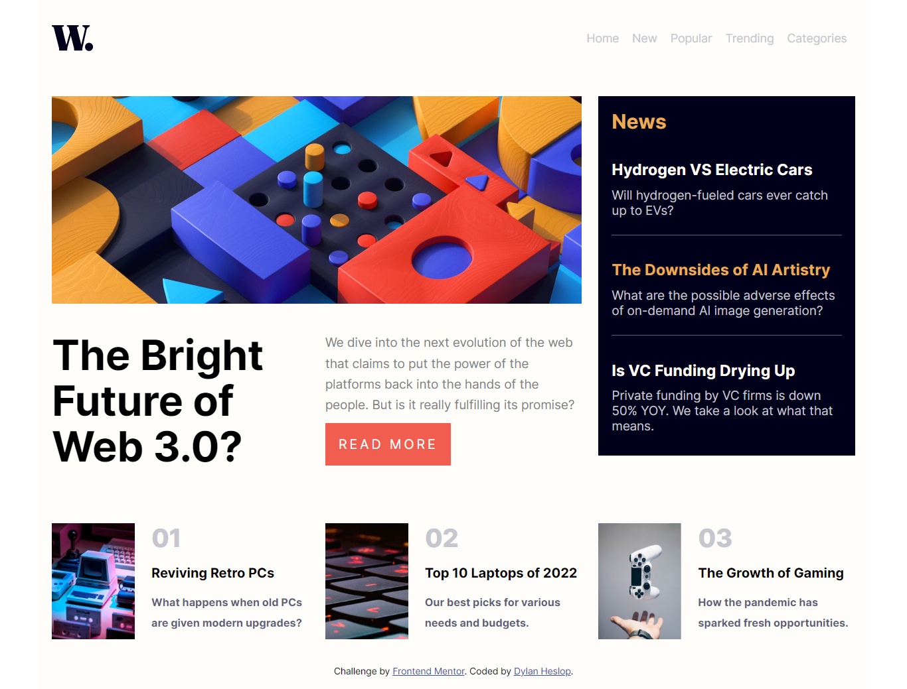

# Frontend Mentor - News homepage solution

This is a solution to the [News homepage challenge on Frontend Mentor](https://www.frontendmentor.io/challenges/news-homepage-H6SWTa1MFl). Frontend Mentor challenges help you improve your coding skills by building realistic projects. 

## Table of contents

- [Overview](#overview)
  - [The challenge](#the-challenge)
  - [Screenshot](#screenshot)
  - [Links](#links)
- [My process](#my-process)
  - [Built with](#built-with)
  - [What I learned](#what-i-learned)
  - [Continued development](#continued-development)
 [Useful resources](#useful-resources)
- [Author](#author)

**Note: Delete this note and update the table of contents based on what sections you keep.**

## Overview

### The challenge

Users should be able to:

- View the optimal layout for the interface depending on their device's screen size
- See hover and focus states for all interactive elements on the page

### Screenshot




### Links

- Solution URL: [Add solution URL here](https://your-solution-url.com)
- Live Site URL: [Add live site URL here](https://your-live-site-url.com)

## My process

### Built with

- Semantic HTML5 markup
- CSS custom properties
- Flexbox
- CSS Grid
- SCSS A CSS preprocessor
- Mobile-first workflow
- [React](https://reactjs.org/) - JS library

### What I learned

I learned how to create a responive navbar using React useState hook to monitor the state of the navbar. I had a funny issue where I had to get the screensize of the screen and then set the initial value of the state to true or false. 
Hopefully I find a better way to do it.


This is some code ig... 
used to create a new component base on the data file that I have.
```JSX
  const result = topNews.map((news, index) => {

    return (
      <TopNews data={news} key={index} />
    )
  })
```
```JSX
export default function TopNews(props) {
    return (
        <div className="top--news">
            

            <div>
                <span>{('00' + props.data.id).slice(-2)}</span>
                <h3>{props.data.title}</h3>
                <p>{props.data.description}</p>
            </div>
        </div>
    )
}
```

### Continued development

I have recently learned GRID layout so it was a bit challenging to get the layout I wanted. I hope with more practice it will become easier for me. 
I so far know the basics of React and I can do a few things with state, overall I need to get better at react and thats why I chose this project in the first place.

I also recently learnt Scss but I still have a few more things to go over for it and make my CSS more syntactically Awesome.


## Author
Dylan Heslop
- Website - [Add your name here](https://www.your-site.com)
- Frontend Mentor - [@yourusername](https://www.frontendmentor.io/profile/yourusername)
